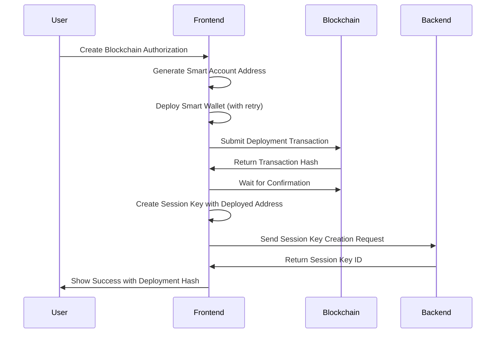

# Smart Wallet Deployment Solution for AA13 Error

## Problem Summary

The **AA13 error** ("initCode failed or OOG") was occurring because:

1. **Frontend**: Created smart wallet addresses using `toSimpleSmartAccount()` but didn't deploy them
2. **Backend**: Tried to deploy smart wallets during transaction execution with insufficient gas
3. **Result**: Smart wallet deployment failed, causing AA13 errors

## Solution: Immediate Smart Wallet Deployment

### What Changed

The solution implements **immediate smart wallet deployment** in the frontend during session key creation, ensuring that:

- Smart wallets are deployed immediately after creation
- Session keys are created with real, deployed smart wallet addresses
- AA13 errors are eliminated entirely
- Cleaner delegation hierarchy: EOA → Smart Wallet (deployed) → Session Key

### Implementation Details

#### 1. **New Deployment Function** (`use-smart-wallet-delegation.ts`)

```typescript
const deploySmartWallet = useCallback(
  async (
    smartAccount: SimpleSmartAccount,
    chainId: string
  ): Promise<{ deployed: boolean; transactionHash?: string }> => {
    // Check if already deployed
    const code = await publicClient.getBytecode({
      address: smartAccount.address,
    });
    if (code && code !== "0x") return { deployed: true };

    // Deploy with retry logic
    const deploymentTx = await smartAccount.sendTransaction({
      to: smartAccount.address,
      value: 0n,
      data: "0x",
    });

    // Wait for confirmation
    const receipt = await publicClient.waitForTransactionReceipt({
      hash: deploymentTx,
    });
    return { deployed: true, transactionHash: deploymentTx };
  },
  [createPublicClientForChain]
);
```

#### 2. **Updated Smart Account Creation Flow**

```typescript
const createSmartAccountClient = useCallback(async (chainId: string) => {
  const simpleSmartAccount = await createSmartAccount(chainId);

  // Deploy immediately to prevent AA13 errors
  const deploymentResult = await deploySmartWallet(simpleSmartAccount, chainId);

  if (!deploymentResult.deployed) {
    throw new Error("Failed to deploy smart wallet");
  }

  return {
    client: createPermissionlessSmartAccountClient({...}),
    account: simpleSmartAccount,
    deploymentHash: deploymentResult.transactionHash, // Track deployment
  };
}, [createSmartAccount, deploySmartWallet]);
```

#### 3. **Enhanced UI with Deployment Status** (`enhanced-blockchain-authorization-modal.tsx`)

- **Deployment Progress Indicator**: Shows when smart wallet is being deployed
- **Success Confirmation**: Displays deployment transaction hash
- **Button States**: Disabled during deployment to prevent multiple deployments
- **User Feedback**: Clear messaging about deployment status

#### 4. **Updated Backend Guidance** (`SendTransactionBlock.ts`)

The backend now provides better error messages since deployment is handled by the frontend:

```typescript
throw new Error(
  `⚠️ Smart Wallet Not Deployed\n\n` +
    `Note: Smart wallet deployment is now handled automatically by the frontend during session key creation.`
);
```

### Benefits

1. **Eliminates AA13 Errors**: Smart wallets are deployed before session key creation
2. **Better User Experience**: Users see deployment progress and confirmation
3. **Cleaner Architecture**: Clear separation of concerns (frontend deploys, backend executes)
4. **Retry Logic**: Built-in retry mechanism for deployment failures
5. **Transaction Tracking**: Deployment hashes are tracked and displayed

### Deployment Flow



### Error Handling

- **Retry Logic**: Up to 3 attempts with exponential backoff
- **Timeout Protection**: 2-minute timeout for deployment confirmation
- **Status Tracking**: Clear deployment status throughout the process
- **User Guidance**: Helpful error messages if deployment fails

### Testing

To test the solution:

1. **Create New Blockchain Authorization**: The smart wallet should deploy automatically
2. **Check Deployment Status**: UI should show deployment progress and confirmation
3. **Verify Transaction**: Deployment hash should be visible and clickable
4. **Execute Workflow**: Should work without AA13 errors

### Future Enhancements

1. **Gas Estimation**: Add gas estimation for deployment transactions
2. **Network Support**: Extend to more chains beyond SEI, Base, Ethereum
3. **Deployment Monitoring**: Track deployment success rates and gas costs
4. **Fallback Mechanisms**: Alternative deployment strategies if primary fails

## Conclusion

This solution provides a robust, user-friendly approach to smart wallet deployment that eliminates AA13 errors while maintaining security and providing excellent user experience. The frontend now handles the complex deployment process automatically, ensuring that session keys are always created with deployed smart wallets.
