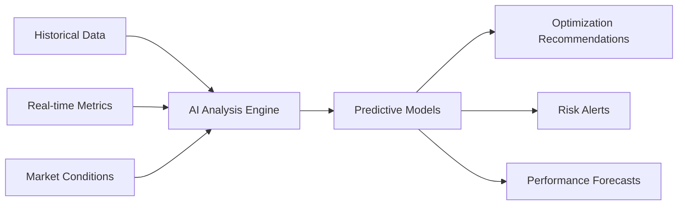

<Alert type="warning">
  **Current Status**: Zzyra currently provides basic AI-assisted workflow generation through OpenRouter integration. Many advanced capabilities described here are part of our development roadmap.
</Alert>

## What Makes Zzyra AI-Assisted?

Zzyra integrates artificial intelligence capabilities to enhance workflow creation and automation. Rather than traditional rule-based automation, AI assists users in generating workflows from natural language and provides intelligent suggestions.

<Info>
  **Current Reality**: Zzyra uses AI to help generate workflow structures from natural language prompts. 
  **Future Vision**: Expanding to include optimization, predictive analytics, and advanced decision-making.
</Info>

## AI Throughout the Platform

### 1. Intelligent Workflow Generation

Transform natural language descriptions into functional, executable workflows:

<Tabs>
  <Tab title='Natural Language Input'>
    **User Says:** "Monitor my DeFi portfolio and rebalance when USDC allocation
    drops below 20%, but only during US market hours to optimize gas fees"
  </Tab>

{" "}

<Tab title='AI Interpretation'>
  **AI Understands:** - Portfolio monitoring requirement - Conditional logic
  (threshold-based triggers) - Time-based constraints - Gas optimization
  requirements - Multi-step automation needs
</Tab>

  <Tab title='Generated Workflow'>
    **AI Creates:** - Portfolio monitoring blocks - Conditional logic nodes -
    Time scheduling constraints - Gas price optimization - Rebalancing execution
    blocks - Notification and logging
  </Tab>
</Tabs>

### 2. Dynamic Optimization Engine

<Alert type="warning">
  **Development Roadmap**: These advanced optimization features are planned for future implementation.
</Alert>

Planned AI optimization capabilities for workflow parameters:

<AccordionGroup>
  <Accordion title='Gas Fee Optimization' icon='fuel-pump'>
    📋 Planned: AI will analyze network congestion patterns, transaction urgency, and cost
    trade-offs to automatically optimize gas prices for blockchain transactions.
  </Accordion>

{" "}

<Accordion title='Resource Allocation' icon='chart-line'>
  📋 Planned: Intelligent management of compute resources, API rate limits, and execution timing
  to maximize efficiency while minimizing costs across all connected systems.
</Accordion>

{" "}

<Accordion title='Risk Assessment' icon='triangle-exclamation'>
  📋 Planned: Continuous evaluation of workflow risks, market conditions, and external factors
  to automatically adjust parameters or pause operations when necessary.
</Accordion>

  <Accordion title='Performance Learning' icon='brain'>
    📋 Planned: Learning from past executions to improve future performance, identifying
    patterns and optimizing workflows based on successful outcomes.
  </Accordion>
</AccordionGroup>

### 3. Predictive Analytics & Insights

<Alert type="info">
  **Development Vision**: Advanced analytics capabilities planned for future implementation.
</Alert>

Planned AI capabilities for process optimization and decision support:

**Planned Key Capabilities:**

- **Anomaly Detection**: 📋 Planned - Identify unusual patterns that may indicate issues or opportunities
- **Trend Prediction**: 📋 Planned - Forecast market movements, protocol changes, or system performance
- **Cost Optimization**: 📋 Planned - Predict optimal timing for expensive operations
- **Failure Prevention**: 📋 Planned - Identify potential workflow failures before they occur

### 4. Natural Language Interface

<Info>
  **Current Status**: Basic natural language workflow generation available. Advanced conversational features planned.
</Info>

Interact with automations using plain English:

<CardGroup cols={2}>
  <Card title='Workflow Creation' icon='wand-magic-sparkles'>
    ✅ Current: "Create a workflow that buys ETH when it drops 5% and sells when it gains 10%"
  </Card>
  <Card title='Workflow Modification' icon='edit'>
    📋 Planned: "Change the sell threshold from 10% to 15% and add a stop-loss at 3%"
  </Card>
  <Card title='Troubleshooting' icon='bug'>
    📋 Planned: "Why did my DeFi workflow fail last night?"
  </Card>
  <Card title='Optimization Suggestions' icon='lightbulb'>
    📋 Planned: "How can I improve the performance of my yield farming automation?"
  </Card>
</CardGroup>

## AI-Powered Block System

### Intelligent Block Recommendations

<Alert type="info">
  **Development Status**: Basic AI suggestions available. Advanced recommendation engine in development.
</Alert>

Planned AI-powered workflow assistance:

- **Context-Aware Suggestions**: 🚧 In Development - Recommend blocks based on workflow purpose
- **Best Practice Integration**: 📋 Planned - Suggest error handling, logging, and optimization blocks
- **Missing Logic Detection**: 📋 Planned - Identify gaps in workflow logic and suggest solutions
- **Performance Optimization**: 📋 Planned - Recommend more efficient block combinations

### Custom Block Generation

<Info>
  **Current Status**: Basic AI-assisted block creation available with OpenRouter integration.
</Info>

AI-powered custom block creation process:

<Steps>
  <Step title='Describe Functionality'>
    ✅ Current: "I need a block that monitors Compound lending rates and alerts me when APY goes above 8%"
  </Step>
  <Step title='AI Analysis'>
    ✅ Current: AI understands requirements: data source (Compound), condition (APY > 8%), action (alert)
  </Step>
  <Step title='Code Generation'>
    🚧 In Development: AI generates TypeScript/JavaScript code with proper inputs, outputs, and error handling
  </Step>
  <Step title='Testing & Validation'>
    📋 Planned: AI creates test cases and validates the block's functionality
  </Step>
</Steps>

## Advanced AI Capabilities

<Alert type="warning">
  **Future Development**: These advanced capabilities represent our long-term AI vision.
</Alert>

### Multi-Modal Intelligence

Planned AI capabilities for processing different data types:

<Tabs>
  <Tab title='Text Processing'>
    ✅ Current: Natural language workflow descriptions
    📋 Planned: Document analysis, sentiment analysis, error message interpretation
  </Tab>

{" "}

<Tab title='Data Analysis'>
  📋 Planned: Time series analysis for trading strategies, pattern recognition in
  blockchain data, statistical modeling for risk assessment, correlation
  analysis across markets
</Tab>

{" "}

<Tab title='Visual Processing'>
  📋 Planned: Chart pattern recognition, document OCR and data extraction, image-based
  NFT analysis, technical indicator interpretation
</Tab>

  <Tab title='Voice Commands'>
    📋 Planned: Spoken workflow creation, voice-activated trading commands, audio
    notification preferences, hands-free portfolio management
  </Tab>
</Tabs>

### Contextual Decision Making

<Alert type="info">
  **Development Vision**: Advanced contextual AI decision-making planned for future implementation.
</Alert>

Planned AI enhancement beyond rule execution:

**Example: Smart DeFi Position Management (Planned)**

Traditional Rule: "Sell when price drops 5%"

Planned AI-Enhanced Decision:

- 📋 Planned: Consider current market volatility
- 📋 Planned: Analyze correlation with broader market movements
- 📋 Planned: Evaluate gas costs vs. position size
- 📋 Planned: Factor in upcoming events (protocol upgrades, governance votes)
- 📋 Planned: Assess liquidity conditions
- **Future Result**: May hold position during temporary market dip but sell during sustained downtrend

## Privacy & Security

### AI Data Handling

<Warning>
  Zzyra's AI processes data locally and through secure channels. Private keys
  and sensitive credentials are never shared with AI models. All AI interactions
  are encrypted and logged for security auditing.
</Warning>

- **Local Processing**: Sensitive operations processed on secure infrastructure
- **Encrypted Communications**: All AI model interactions use encrypted channels
- **Data Minimization**: Only necessary data shared with AI services
- **Audit Trails**: Complete logging of AI decisions and actions

### Explainable AI

Understand why AI makes specific recommendations:

- **Decision Transparency**: Clear explanations for AI suggestions
- **Confidence Scores**: AI provides confidence levels for predictions
- **Alternative Options**: Shows other considered approaches
- **Learning Sources**: Indicates what data informed decisions

## Getting Started with AI Features

### For Beginners

<CardGroup cols={2}>
  <Card title='AI Workflow Assistant' icon='robot'>
    Start with simple natural language descriptions and let AI build your
    workflows
  </Card>
  <Card title='Template Library' icon='book-open'>
    Use AI-generated templates for common automation patterns
  </Card>
</CardGroup>

### For Advanced Users

<CardGroup cols={2}>
  <Card title='Custom AI Blocks' icon='code'>
    Generate sophisticated custom blocks using natural language specifications
  </Card>
  <Card title='Advanced Analytics' icon='chart-line'>
    Leverage AI for complex market analysis and strategy optimization
  </Card>
</CardGroup>

## Real-World AI Applications

### DeFi Strategy Optimization

**Scenario**: Automated yield farming across multiple protocols

**AI Enhancements**:

- Predicts optimal entry/exit timing based on gas costs and yields
- Identifies emerging yield opportunities before they become saturated
- Automatically adjusts strategy based on protocol risk assessments
- Optimizes capital allocation across available opportunities

### Enterprise Process Automation

**Scenario**: Employee onboarding with DID integration

**AI Enhancements**:

- Intelligently routes credentials based on role and department
- Predicts required access levels based on similar employees
- Identifies potential security risks in access patterns
- Optimizes onboarding timeline based on workload and availability

### Cross-Chain Asset Management

**Scenario**: Multi-chain portfolio management

**AI Enhancements**:

- Predicts optimal bridge timing to minimize costs
- Identifies arbitrage opportunities across chains
- Automatically rebalances based on chain-specific market conditions
- Manages liquidity across multiple ecosystems intelligently

## Future AI Developments

### Roadmap Highlights

- **Advanced Market Prediction**: Enhanced forecasting models for better trading decisions
- **Automated Strategy Evolution**: AI that improves strategies based on performance
- **Collaborative AI**: Multiple AI agents working together on complex workflows
- **Personalized Optimization**: AI that learns individual user preferences and patterns

<Info>
  Zzyra's AI capabilities continue to evolve. The platform is designed to
  incorporate new AI advancements seamlessly, ensuring users always have access
  to cutting-edge intelligence in their automation workflows.
</Info>

## Learn More

Ready to explore AI-assisted automation?

<CardGroup cols={3}>
  <Card title='Quick Start' icon='rocket' href='/quickstart'>
    Try current AI workflow generation
  </Card>
  <Card
    title='Development Status'
    icon='info'
    href='/development-status'>
    See current AI capabilities and roadmap
  </Card>
  <Card title='Use Cases' icon='lightbulb' href='/platform/use-cases/overview'>
    Explore planned AI applications
  </Card>
</CardGroup>{" "}
