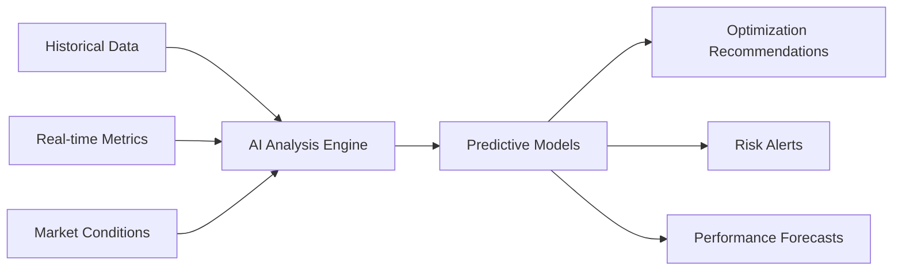

## What Makes Zzyra AI-Native?

Unlike traditional automation platforms where AI is an add-on feature, Zzyra is architected with artificial intelligence as a core foundational component. AI permeates every aspect of the platform, from workflow generation and optimization to predictive analytics and natural language interaction.

<Info>
  AI-native design means intelligence is embedded at the architectural level,
  not bolted on as an afterthought. This fundamental approach enables
  capabilities impossible with traditional automation tools.
</Info>

## AI Throughout the Platform

### 1. Intelligent Workflow Generation

Transform natural language descriptions into functional, executable workflows:

<Tabs>
  <Tab title='Natural Language Input'>
    **User Says:** "Monitor my DeFi portfolio and rebalance when USDC allocation
    drops below 20%, but only during US market hours to optimize gas fees"
  </Tab>

{" "}

<Tab title='AI Interpretation'>
  **AI Understands:** - Portfolio monitoring requirement - Conditional logic
  (threshold-based triggers) - Time-based constraints - Gas optimization
  requirements - Multi-step automation needs
</Tab>

  <Tab title='Generated Workflow'>
    **AI Creates:** - Portfolio monitoring blocks - Conditional logic nodes -
    Time scheduling constraints - Gas price optimization - Rebalancing execution
    blocks - Notification and logging
  </Tab>
</Tabs>

### 2. Dynamic Optimization Engine

AI continuously optimizes workflow parameters based on real-time conditions and historical data:

<AccordionGroup>
  <Accordion title='Gas Fee Optimization' icon='fuel-pump'>
    AI analyzes network congestion patterns, transaction urgency, and cost
    trade-offs to automatically optimize gas prices for blockchain transactions,
    potentially saving hundreds of dollars monthly for active users.
  </Accordion>

{" "}

<Accordion title='Resource Allocation' icon='chart-line'>
  Intelligently manages compute resources, API rate limits, and execution timing
  to maximize efficiency while minimizing costs across all connected systems.
</Accordion>

{" "}

<Accordion title='Risk Assessment' icon='triangle-exclamation'>
  Continuously evaluates workflow risks, market conditions, and external factors
  to automatically adjust parameters or pause operations when necessary.
</Accordion>

  <Accordion title='Performance Learning' icon='brain'>
    Learns from past executions to improve future performance, identifying
    patterns and optimizing workflows based on successful outcomes.
  </Accordion>
</AccordionGroup>

### 3. Predictive Analytics & Insights

Leverage AI for process optimization and decision support:

**Key Capabilities:**

- **Anomaly Detection**: Identify unusual patterns that may indicate issues or opportunities
- **Trend Prediction**: Forecast market movements, protocol changes, or system performance
- **Cost Optimization**: Predict optimal timing for expensive operations
- **Failure Prevention**: Identify potential workflow failures before they occur

### 4. Natural Language Interface

Interact with complex automations using plain English:

<CardGroup cols={2}>
  <Card title='Workflow Creation' icon='wand-magic-sparkles'>
    "Create a workflow that buys ETH when it drops 5% and sells when it gains
    10%"
  </Card>
  <Card title='Workflow Modification' icon='edit'>
    "Change the sell threshold from 10% to 15% and add a stop-loss at 3%"
  </Card>
  <Card title='Troubleshooting' icon='bug'>
    "Why did my DeFi workflow fail last night?"
  </Card>
  <Card title='Optimization Suggestions' icon='lightbulb'>
    "How can I improve the performance of my yield farming automation?"
  </Card>
</CardGroup>

## AI-Powered Block System

### Intelligent Block Recommendations

As you build workflows, AI suggests relevant blocks and connections:

- **Context-Aware Suggestions**: Recommends blocks based on your workflow's purpose
- **Best Practice Integration**: Suggests error handling, logging, and optimization blocks
- **Missing Logic Detection**: Identifies gaps in workflow logic and suggests solutions
- **Performance Optimization**: Recommends more efficient block combinations

### Custom Block Generation

AI can generate custom blocks from natural language descriptions:

<Steps>
  <Step title='Describe Functionality'>
    "I need a block that monitors Compound lending rates and alerts me when APY
    goes above 8%"
  </Step>
  <Step title='AI Analysis'>
    AI understands requirements: data source (Compound), condition (APY > 8%),
    action (alert)
  </Step>
  <Step title='Code Generation'>
    AI generates TypeScript/JavaScript code with proper inputs, outputs, and
    error handling
  </Step>
  <Step title='Testing & Validation'>
    AI creates test cases and validates the block's functionality
  </Step>
</Steps>

## Advanced AI Capabilities

### Multi-Modal Intelligence

Zzyra's AI can process different types of data and inputs:

<Tabs>
  <Tab title='Text Processing'>
    - Document analysis and extraction - Sentiment analysis of social media -
    Natural language workflow descriptions - Error message interpretation
  </Tab>

{" "}

<Tab title='Data Analysis'>
  - Time series analysis for trading strategies - Pattern recognition in
  blockchain data - Statistical modeling for risk assessment - Correlation
  analysis across markets
</Tab>

{" "}

<Tab title='Visual Processing'>
  - Chart pattern recognition - Document OCR and data extraction - Image-based
  NFT analysis - Technical indicator interpretation
</Tab>

  <Tab title='Voice Commands'>
    - Spoken workflow creation - Voice-activated trading commands - Audio
    notification preferences - Hands-free portfolio management
  </Tab>
</Tabs>

### Contextual Decision Making

AI doesn't just execute rules—it makes intelligent decisions based on context:

**Example: Smart DeFi Position Management**

Traditional Rule: "Sell when price drops 5%"

AI-Enhanced Decision:

- Considers current market volatility
- Analyzes correlation with broader market movements
- Evaluates gas costs vs. position size
- Factors in upcoming events (protocol upgrades, governance votes)
- Assesses liquidity conditions
- **Result**: May hold position during temporary market dip but sell during sustained downtrend

## Privacy & Security

### AI Data Handling

<Warning>
  Zzyra's AI processes data locally and through secure channels. Private keys
  and sensitive credentials are never shared with AI models. All AI interactions
  are encrypted and logged for security auditing.
</Warning>

- **Local Processing**: Sensitive operations processed on secure infrastructure
- **Encrypted Communications**: All AI model interactions use encrypted channels
- **Data Minimization**: Only necessary data shared with AI services
- **Audit Trails**: Complete logging of AI decisions and actions

### Explainable AI

Understand why AI makes specific recommendations:

- **Decision Transparency**: Clear explanations for AI suggestions
- **Confidence Scores**: AI provides confidence levels for predictions
- **Alternative Options**: Shows other considered approaches
- **Learning Sources**: Indicates what data informed decisions

## Getting Started with AI Features

### For Beginners

<CardGroup cols={2}>
  <Card title='AI Workflow Assistant' icon='robot'>
    Start with simple natural language descriptions and let AI build your
    workflows
  </Card>
  <Card title='Template Library' icon='book-open'>
    Use AI-generated templates for common automation patterns
  </Card>
</CardGroup>

### For Advanced Users

<CardGroup cols={2}>
  <Card title='Custom AI Blocks' icon='code'>
    Generate sophisticated custom blocks using natural language specifications
  </Card>
  <Card title='Advanced Analytics' icon='chart-line'>
    Leverage AI for complex market analysis and strategy optimization
  </Card>
</CardGroup>

## Real-World AI Applications

### DeFi Strategy Optimization

**Scenario**: Automated yield farming across multiple protocols

**AI Enhancements**:

- Predicts optimal entry/exit timing based on gas costs and yields
- Identifies emerging yield opportunities before they become saturated
- Automatically adjusts strategy based on protocol risk assessments
- Optimizes capital allocation across available opportunities

### Enterprise Process Automation

**Scenario**: Employee onboarding with DID integration

**AI Enhancements**:

- Intelligently routes credentials based on role and department
- Predicts required access levels based on similar employees
- Identifies potential security risks in access patterns
- Optimizes onboarding timeline based on workload and availability

### Cross-Chain Asset Management

**Scenario**: Multi-chain portfolio management

**AI Enhancements**:

- Predicts optimal bridge timing to minimize costs
- Identifies arbitrage opportunities across chains
- Automatically rebalances based on chain-specific market conditions
- Manages liquidity across multiple ecosystems intelligently

## Future AI Developments

### Roadmap Highlights

- **Advanced Market Prediction**: Enhanced forecasting models for better trading decisions
- **Automated Strategy Evolution**: AI that improves strategies based on performance
- **Collaborative AI**: Multiple AI agents working together on complex workflows
- **Personalized Optimization**: AI that learns individual user preferences and patterns

<Info>
  Zzyra's AI capabilities continue to evolve. The platform is designed to
  incorporate new AI advancements seamlessly, ensuring users always have access
  to cutting-edge intelligence in their automation workflows.
</Info>

## Learn More

Ready to explore AI-native automation?

<CardGroup cols={3}>
  <Card title='Quick Start' icon='rocket' href='/quickstart'>
    Try AI workflow generation
  </Card>
  <Card
    title='AI Engine Details'
    icon='gear'
    href='/platform/architecture/ai-engine'>
    Technical deep dive
  </Card>
  <Card title='Use Cases' icon='lightbulb' href='/platform/use-cases/overview'>
    See AI in action
  </Card>
</CardGroup>{" "}
