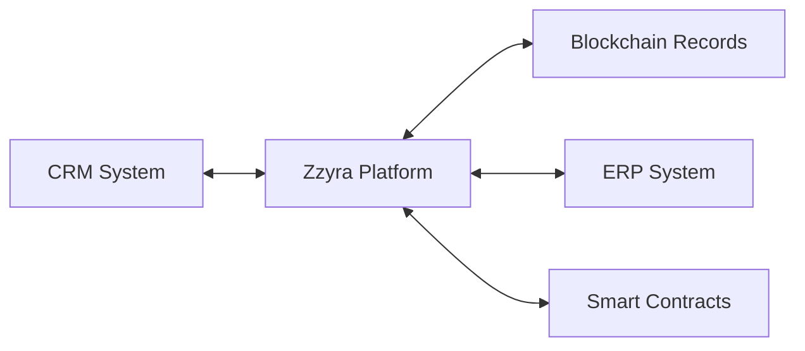

## What is Hybrid Automation?

Hybrid automation refers to the seamless orchestration of workflows that span both traditional Web2 enterprise systems and emerging Web3 decentralized protocols. Unlike traditional automation that operates within a single domain, hybrid automation creates intelligent bridges between these previously disconnected ecosystems.

<Info>
  Zzyra's hybrid automation capabilities enable organizations to leverage the
  best of both worlds—the stability and maturity of enterprise systems with the
  innovation and efficiency of blockchain technology.
</Info>

## The Need for Hybrid Solutions

### Traditional Limitations

Most automation platforms today operate in silos:

- **Web2-Only Platforms**: Excel at enterprise integration but lack blockchain capabilities
- **Web3-Only Tools**: Handle blockchain operations but can't connect to business systems
- **Manual Bridges**: Require custom development and maintenance overhead
- **Data Isolation**: Information trapped in separate systems without flow

### The Hybrid Advantage

Zzyra's hybrid approach unlocks new possibilities:

<CardGroup cols={2}>
  <Card title='Unified Data Flow' icon='arrows-split-up-and-left'>
    Seamlessly move data between enterprise databases and blockchain networks
  </Card>
  <Card title='Process Continuity' icon='link'>
    Create end-to-end workflows that span both domains without manual
    intervention
  </Card>
  <Card title='Risk Reduction' icon='shield-check'>
    Leverage enterprise security practices with blockchain transparency
  </Card>
  <Card title='Innovation Acceleration' icon='rocket'>
    Rapidly prototype and deploy new hybrid business models
  </Card>
</CardGroup>

## Key Hybrid Automation Patterns

### 1. Data Synchronization

Keep information consistent across Web2 and Web3 systems:



**Example Use Cases:**

- Customer data synchronized with on-chain loyalty tokens
- Inventory tracking bridged to supply chain blockchain
- Financial records reconciled across traditional and DeFi systems

### 2. Event-Driven Workflows

Trigger actions across domains based on events:

<Tabs>
  <Tab title='Web2 → Web3'>
    - CRM lead triggers NFT airdrop - Payment completion mints utility token -
    Employee onboarding provisions wallet access
  </Tab>

{" "}
<Tab title='Web3 → Web2'>
  - Token transfer updates CRM record - Smart contract execution generates
  invoice - DAO vote triggers policy update in HRIS
</Tab>

  <Tab title='Bidirectional'>
    - Cross-ledger payment reconciliation - Multi-system approval workflows -
    Synchronized governance processes
  </Tab>
</Tabs>

### 3. Authentication & Identity

Leverage decentralized identity within enterprise workflows:

<AccordionGroup>
  <Accordion title='Single Sign-On (SSO) with DIDs' icon='key'>
    Use decentralized identifiers for seamless access across traditional and
    Web3 applications, reducing password fatigue while improving security.
  </Accordion>

{" "}
<Accordion title='Credential Verification' icon='certificate'>
  Verify employee qualifications, certifications, or achievements stored as
  verifiable credentials on-chain within HR systems.
</Accordion>

  <Accordion title='Multi-Factor Authentication' icon='lock'>
    Combine traditional MFA with blockchain-based authentication for enhanced
    security in critical business operations.
  </Accordion>
</AccordionGroup>

### 4. Financial Operations

Integrate traditional and digital asset management:

- **Cross-Ledger Payments**: Automate vendor payments using both fiat and cryptocurrency
- **Treasury Management**: Balance holdings across traditional banks and DeFi protocols
- **Compliance Reporting**: Aggregate financial data from all sources for regulatory requirements
- **Risk Management**: Monitor exposure across traditional and crypto markets

## Technical Architecture

### Chain-Agnostic Layer

Zzyra's hybrid automation is built on a chain-agnostic foundation:

```typescript
interface IBlockchainService {
  getBalance(address: string): Promise<Balance>;
  sendTransaction(params: TransactionParams): Promise<TransactionResult>;
  callContractFunction(
    contract: string,
    method: string,
    params: any[]
  ): Promise<any>;
  subscribeToEvents(
    contract: string,
    event: string
  ): Promise<EventSubscription>;
}
```

This abstraction enables:

- **Uniform Operations**: Same workflow logic across different blockchains
- **Easy Migration**: Switch between chains without rebuilding workflows
- **Multi-Chain Workflows**: Operate across multiple blockchains simultaneously
- **Future-Proofing**: Add new blockchain support without breaking existing workflows

### Enterprise Integration

Standardized connectors for business systems:

- **API Integration**: REST, GraphQL, SOAP protocol support
- **Database Connectivity**: SQL, NoSQL, data warehouse connections
- **File Processing**: Automated document and data file handling
- **Message Queues**: Integration with enterprise messaging systems

## Security Considerations

### Credential Management

Hybrid automation requires sophisticated credential handling:

<Warning>
  Never store private keys or sensitive credentials in plaintext. Zzyra uses
  enterprise-grade secure vaults and hardware security modules (HSMs) where
  applicable.
</Warning>

- **Segregated Storage**: Web2 and Web3 credentials stored separately
- **Role-Based Access**: Granular permissions for different system access
- **Audit Trails**: Comprehensive logging of all credential usage
- **Rotation Policies**: Automated credential refresh and rotation

### Transaction Safety

Protecting both traditional and blockchain operations:

- **Simulation Mode**: Test workflows without affecting production systems
- **Approval Workflows**: Multi-signature requirements for critical operations
- **Rate Limiting**: Prevent runaway automation from causing damage
- **Rollback Capabilities**: Reverse operations when possible if errors occur

## Best Practices

### Design Principles

1. **Start Simple**: Begin with basic data synchronization before complex workflows
2. **Fail Gracefully**: Design for partial failures and recovery scenarios
3. **Monitor Everything**: Comprehensive logging and alerting across all systems
4. **Test Thoroughly**: Validate workflows in staging environments first

### Implementation Strategy

<Steps>
  <Step title='Assess Current Systems'>
    Inventory existing Web2 systems and identify integration points
  </Step>
  <Step title='Define Objectives'>
    Clearly specify what hybrid automation should accomplish
  </Step>
  <Step title='Start with Pilot'>
    Implement a simple, low-risk workflow first
  </Step>
  <Step title='Iterate and Expand'>
    Gradually add complexity and additional integrations
  </Step>
  <Step title='Scale and Optimize'>
    Optimize performance and expand to production scale
  </Step>
</Steps>

## Real-World Examples

### Enterprise Onboarding with DIDs

A complete employee onboarding workflow:

1. **HR System**: New hire enters HRIS
2. **Identity Creation**: DID and initial credentials generated
3. **Access Provisioning**: Both traditional (email, VPN) and Web3 (DAO tools) access configured
4. **Credential Verification**: Educational and professional credentials verified on-chain
5. **Welcome Package**: Traditional email + NFT welcome badge sent

### Cross-Ledger Accounts Payable

Automated vendor payment processing:

1. **Invoice Receipt**: Vendor invoice received via traditional channels
2. **Validation**: AI extracts data and validates against purchase orders
3. **Approval**: Traditional approval workflow in ERP system
4. **Payment Selection**: AI determines optimal payment method (fiat vs. crypto)
5. **Execution**: Payment sent via banking API or blockchain transaction
6. **Reconciliation**: Both traditional accounting and on-chain records updated

## Getting Started with Hybrid Automation

Ready to bridge your Web2 and Web3 systems?

<CardGroup cols={3}>
  <Card title='Quick Start Guide' icon='play' href='/quickstart'>
    Build your first hybrid workflow
  </Card>
  <Card
    title='Use Case Examples'
    icon='lightbulb'
    href='/platform/use-cases/hybrid-workflows'>
    Explore real implementations
  </Card>
  <Card
    title='Architecture Details'
    icon='gear'
    href='/platform/architecture/chain-agnostic'>
    Technical deep dive
  </Card>
</CardGroup>{" "}
