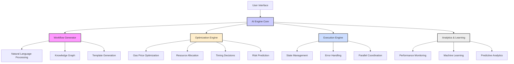
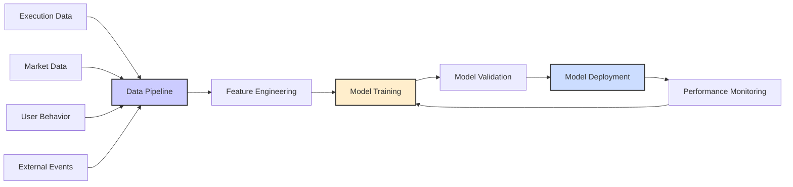

## AI-Powered Intelligent Orchestration

The AI Workflow Engine is the intelligent heart of Zzyra, responsible for executing, managing, and optimizing workflows with embedded artificial intelligence. Unlike traditional automation engines that simply execute predefined rules, Zzyra's AI engine brings genuine intelligence to workflow orchestration.

<Info>
  The AI engine doesn't just execute workflows—it understands them, optimizes
  them, and continuously learns to improve performance across both Web2 and Web3
  operations.
</Info>

## Architecture Overview



## Core AI Capabilities

### 1. Intelligent Workflow Generation

Transform natural language into executable workflows:

<AccordionGroup>
  <Accordion title='Natural Language Understanding' icon='comment'>
    Advanced NLP models interpret user intent, extract parameters, and
    understand context to generate appropriate workflow structures.
  </Accordion>

{" "}

<Accordion title='Domain Knowledge Integration' icon='brain'>
  AI leverages deep knowledge of Web3 protocols, enterprise systems, and best
  practices to create optimal workflow designs.
</Accordion>

{" "}

<Accordion title='Context-Aware Generation' icon='lightbulb'>
  Considers user's existing workflows, preferences, and historical performance
  to generate personalized automation solutions.
</Accordion>

  <Accordion title='Multi-Step Reasoning' icon='sitemap'>
    Breaks down complex automation requirements into logical sequences of
    interconnected blocks and decision points.
  </Accordion>
</AccordionGroup>

### 2. Dynamic Optimization Engine

AI continuously optimizes workflow parameters in real-time:

#### Gas Fee Optimization

```typescript
interface GasOptimization {
  analyzeNetworkConditions(): Promise<NetworkConditions>;
  predictOptimalTiming(urgency: TransactionUrgency): Promise<OptimalTiming>;
  calculateGasStrategy(transaction: Transaction): Promise<GasStrategy>;
}

class AIGasOptimizer implements GasOptimization {
  async calculateGasStrategy(transaction: Transaction): Promise<GasStrategy> {
    const networkConditions = await this.analyzeNetworkConditions();
    const historicalData = await this.getHistoricalGasData();
    const urgency = transaction.urgency || "medium";

    // AI model predicts optimal gas price
    const prediction = await this.aiModel.predictGasPrice({
      networkConditions,
      historicalData,
      transactionType: transaction.type,
      urgency,
    });

    return {
      gasPrice: prediction.optimalPrice,
      confidence: prediction.confidence,
      estimatedSavings: prediction.estimatedSavings,
      timing: prediction.optimalTiming,
    };
  }
}
```

#### Resource Allocation

<Tabs>
  <Tab title='Compute Resources'>
    - **CPU Allocation**: Dynamic allocation based on workflow complexity -
    **Memory Management**: Intelligent memory usage for large datasets -
    **Concurrent Execution**: Optimal parallelization of independent tasks -
    **Load Balancing**: Distribute execution across available resources
  </Tab>

{" "}

<Tab title='API Rate Limits'>
  - **Usage Prediction**: Forecast API usage patterns - **Intelligent Queuing**:
  Optimize API call timing - **Fallback Strategies**: Alternative endpoints when
  limits are reached - **Cost Optimization**: Balance speed vs. cost for API
  services
</Tab>

  <Tab title='Network Resources'>
    - **RPC Optimization**: Select optimal RPC endpoints - **Connection
    Pooling**: Efficient network connection management - **Retry Strategies**:
    Intelligent retry with exponential backoff - **Failover Logic**: Automatic
    failover to backup services
  </Tab>
</Tabs>

### 3. Predictive Analytics & Decision Support

#### Market Prediction Models

```typescript
interface MarketPredictor {
  predictPriceMovement(
    asset: string,
    timeframe: number
  ): Promise<PricePrediction>;
  assessVolatility(market: string): Promise<VolatilityAssessment>;
  identifyArbitrageOpportunities(): Promise<ArbitrageOpportunity[]>;
}

interface PricePrediction {
  asset: string;
  currentPrice: number;
  predictedPrice: number;
  confidence: number;
  timeframe: number;
  factors: PriceFactor[];
}

interface PriceFactor {
  name: string;
  impact: number; // -1 to 1
  confidence: number;
  description: string;
}
```

#### Risk Assessment

<CardGroup cols={2}>
  <Card title='Protocol Risk Analysis' icon='shield-exclamation'>
    Evaluate smart contract risks, audit status, and protocol health before
    execution
  </Card>
  <Card title='Market Risk Assessment' icon='chart-line'>
    Analyze market conditions, liquidity, and potential slippage for DeFi
    operations
  </Card>
  <Card title='Operational Risk Management' icon='triangle-exclamation'>
    Monitor system health, external dependencies, and execution environment
    risks
  </Card>
  <Card title='Compliance Risk Evaluation' icon='balance-scale'>
    Assess regulatory compliance and potential legal implications of actions
  </Card>
</CardGroup>

## AI-Enhanced Execution

### Intelligent State Management

The AI engine maintains sophisticated state management:

```typescript
interface WorkflowState {
  id: string;
  status: WorkflowStatus;
  currentStep: number;
  context: ExecutionContext;
  aiInsights: AIInsights;
  optimizations: Optimization[];
}

interface AIInsights {
  predictedDuration: number;
  riskAssessment: RiskLevel;
  optimizationSuggestions: string[];
  alternativeStrategies: Strategy[];
}

class AIStateManager {
  async updateState(workflowId: string, stepResult: StepResult): Promise<void> {
    const currentState = await this.getState(workflowId);
    const aiAnalysis = await this.analyzeStepResult(stepResult);

    // AI determines next best action
    const nextAction = await this.ai.determineNextAction({
      currentState,
      stepResult,
      marketConditions: await this.getMarketConditions(),
      userPreferences: await this.getUserPreferences(workflowId),
    });

    await this.updateStateWithAIRecommendations(workflowId, nextAction);
  }
}
```

### Adaptive Error Handling

AI-powered error recovery and learning:

<AccordionGroup>
  <Accordion title='Error Pattern Recognition' icon='pattern'>
    AI identifies recurring error patterns and develops preventive strategies to
    avoid similar issues in future executions.
  </Accordion>

{" "}

<Accordion title='Intelligent Recovery' icon='rotate'>
  AI analyzes error context and automatically selects the most appropriate
  recovery strategy based on success probability.
</Accordion>

{" "}

<Accordion title='Learning from Failures' icon='graduation-cap'>
  Each failure provides training data to improve future error prediction and
  prevention capabilities.
</Accordion>

  <Accordion title='Proactive Intervention' icon='bell'>
    AI predicts potential failures before they occur and takes preventive action
    or alerts users.
  </Accordion>
</AccordionGroup>

## Machine Learning Pipeline

### Data Collection & Processing



### Model Types & Applications

<Tabs>
  <Tab title='Time Series Models'>
    - **LSTM Networks**: For price prediction and market analysis - **ARIMA
    Models**: For trend analysis and forecasting - **Prophet Models**: For
    seasonal pattern recognition - **Transformer Models**: For complex sequence
    prediction
  </Tab>

{" "}

<Tab title='Classification Models'>
  - **Random Forest**: For risk classification and decision trees - **SVM**: For
  pattern classification in market data - **Neural Networks**: For complex
  multi-class classification - **Ensemble Methods**: For robust classification
  decisions
</Tab>

{" "}

<Tab title='Optimization Models'>
  - **Reinforcement Learning**: For strategy optimization - **Genetic
  Algorithms**: For parameter optimization - **Gradient Descent**: For
  continuous optimization - **Bayesian Optimization**: For hyperparameter tuning
</Tab>

  <Tab title='NLP Models'>
    - **Large Language Models**: For workflow generation - **BERT/RoBERTa**: For
    text understanding and classification - **GPT Models**: For text generation
    and completion - **Specialized Models**: For domain-specific language tasks
  </Tab>
</Tabs>

## AI Model Infrastructure

### Model Serving Architecture

```typescript
interface AIModelService {
  loadModel(modelId: string): Promise<Model>;
  predict(modelId: string, input: any): Promise<Prediction>;
  batchPredict(modelId: string, inputs: any[]): Promise<Prediction[]>;
  updateModel(modelId: string, newData: TrainingData): Promise<void>;
}

class DistributedModelService implements AIModelService {
  private modelCache: Map<string, Model> = new Map();
  private loadBalancer: LoadBalancer;

  async predict(modelId: string, input: any): Promise<Prediction> {
    const model = await this.getModel(modelId);
    const endpoint = this.loadBalancer.selectEndpoint(modelId);

    return await endpoint.predict(model, input);
  }
}
```

### Model Performance Monitoring

- **Accuracy Tracking**: Continuous monitoring of prediction accuracy
- **Drift Detection**: Identify when models need retraining
- **A/B Testing**: Compare model versions for optimal performance
- **Feedback Loops**: Incorporate user feedback for model improvement

## Privacy & Security

### AI Data Protection

<Warning>
  Zzyra's AI processes user data with strict privacy controls. Sensitive
  information like private keys and personal data is never used for model
  training or shared with external AI services.
</Warning>

#### Data Handling Principles

<CardGroup cols={2}>
  <Card title='Data Minimization' icon='shield-check'>
    Only necessary data is used for AI processing, with automatic data pruning
  </Card>
  <Card title='Local Processing' icon='server'>
    Sensitive computations performed on secure local infrastructure
  </Card>
  <Card title='Encrypted Communication' icon='lock'>
    All AI model interactions use end-to-end encryption
  </Card>
  <Card title='Audit Trails' icon='file-lines'>
    Complete logging of AI decisions and data usage for compliance
  </Card>
</CardGroup>

#### Model Security

```typescript
interface SecureAIProcessor {
  encryptInput(data: any): EncryptedData;
  processSecurely(encryptedData: EncryptedData): Promise<EncryptedResult>;
  decryptOutput(encryptedResult: EncryptedResult): any;
  auditLog(operation: AIOperation): void;
}

class HomomorphicAIProcessor implements SecureAIProcessor {
  async processSecurely(
    encryptedData: EncryptedData
  ): Promise<EncryptedResult> {
    // Process encrypted data without decryption
    return await this.homomorphicComputation(encryptedData);
  }
}
```

## Performance Optimization

### AI Efficiency Measures

<AccordionGroup>
  <Accordion title='Model Optimization' icon='gauge'>
    Models are optimized for inference speed while maintaining accuracy, with
    quantization and pruning techniques applied where appropriate.
  </Accordion>

{" "}

<Accordion title='Caching Strategies' icon='database'>
  Frequently requested predictions are cached, and similar inputs use cached
  results to reduce computational overhead.
</Accordion>

{" "}

<Accordion title='Batch Processing' icon='layer-group'>
  Multiple requests are batched together for efficient GPU utilization and
  reduced processing latency.
</Accordion>

  <Accordion title='Edge Computing' icon='microchip'>
    Simple AI operations run on edge devices to reduce latency and server load.
  </Accordion>
</AccordionGroup>

## Future AI Developments

### Roadmap Highlights

<Tabs>
  <Tab title='Q1-Q2 2025'>
    - Advanced market prediction models - Multi-modal AI (text, voice, visual) -
    Improved gas optimization algorithms - Enhanced error prediction
  </Tab>

{" "}

<Tab title='Q3-Q4 2025'>
  - Reinforcement learning for strategy optimization - Collaborative AI agents -
  Cross-chain optimization models - Advanced risk assessment
</Tab>

  <Tab title='2026+'>
    - Autonomous strategy evolution - Predictive market making - AI-powered
    protocol interaction - Self-improving automation
  </Tab>
</Tabs>

### Research Areas

- **Federated Learning**: Collaborative model training without data sharing
- **Causal AI**: Understanding cause-and-effect relationships in markets
- **Explainable AI**: Better interpretability of AI decisions
- **Quantum ML**: Preparing for quantum computing advantages

<Info>
  Zzyra's AI engine represents the cutting edge of intelligent automation,
  continuously evolving to provide users with increasingly sophisticated and
  effective automation capabilities.
</Info>

## Learn More

Explore how AI enhances different aspects of Zzyra:

<CardGroup cols={3}>
  <Card
    title='AI-Native Workflows'
    icon='brain'
    href='/concepts/ai-native-workflows'>
    Understanding AI integration
  </Card>
  <Card title='Use Cases' icon='lightbulb' href='/platform/use-cases/overview'>
    AI in real-world scenarios
  </Card>
  <Card title='Developer Guide' icon='code' href='/developers/blocks/ai-blocks'>
    Building AI-powered blocks
  </Card>
</CardGroup>{" "}
