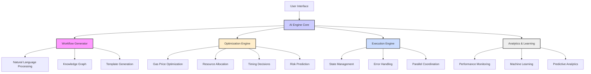
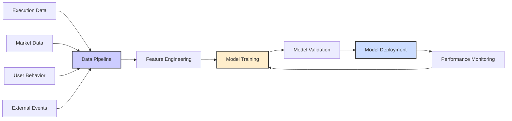

## AI Integration Overview

<Alert type="warning">
  **Development Status**: Zzyra currently has basic AI integration through OpenRouter. Advanced AI capabilities described here represent our development roadmap and vision.
</Alert>

The AI Workflow Engine will be the intelligent heart of Zzyra, designed to execute, manage, and optimize workflows with embedded artificial intelligence. Unlike traditional automation engines that execute predefined rules, Zzyra's planned AI engine will bring genuine intelligence to workflow orchestration.

<Info>
  **Current Status**: Basic AI workflow generation available
  **Vision**: Advanced AI engine that understands, optimizes, and continuously learns to improve performance
</Info>

## Architecture Overview



## AI Development Roadmap

### 1. Intelligent Workflow Generation

<Info>
  **Current Status**: Basic natural language to workflow generation available through OpenRouter integration
  **Development Focus**: Enhanced workflow generation capabilities
</Info>

Current and planned capabilities for transforming natural language into workflows:

<AccordionGroup>
  <Accordion title='Natural Language Understanding' icon='comment'>
    ✅ Current: Basic NLP through OpenRouter for workflow generation
    📋 Planned: Advanced models for intent interpretation and parameter extraction
  </Accordion>

{" "}

<Accordion title='Domain Knowledge Integration' icon='brain'>
  📋 Planned: AI leveraging deep knowledge of Web3 protocols, enterprise systems, and best
  practices to create optimal workflow designs.
</Accordion>

{" "}

<Accordion title='Context-Aware Generation' icon='lightbulb'>
  📋 Planned: Consider user's existing workflows, preferences, and historical performance
  to generate personalized automation solutions.
</Accordion>

  <Accordion title='Multi-Step Reasoning' icon='sitemap'>
    🚧 In Development: Breaking down complex automation requirements into logical sequences of
    interconnected blocks and decision points.
  </Accordion>
</AccordionGroup>

### 2. Dynamic Optimization Engine (Development Vision)

<Alert type="info">
  **Development Roadmap**: Advanced optimization capabilities planned for future implementation.
</Alert>

Planned AI optimization of workflow parameters:

#### Gas Fee Optimization (Planned)

```typescript
interface GasOptimization {
  analyzeNetworkConditions(): Promise<NetworkConditions>;
  predictOptimalTiming(urgency: TransactionUrgency): Promise<OptimalTiming>;
  calculateGasStrategy(transaction: Transaction): Promise<GasStrategy>;
}

class AIGasOptimizer implements GasOptimization {
  async calculateGasStrategy(transaction: Transaction): Promise<GasStrategy> {
    const networkConditions = await this.analyzeNetworkConditions();
    const historicalData = await this.getHistoricalGasData();
    const urgency = transaction.urgency || "medium";

    // AI model predicts optimal gas price
    const prediction = await this.aiModel.predictGasPrice({
      networkConditions,
      historicalData,
      transactionType: transaction.type,
      urgency,
    });

    return {
      gasPrice: prediction.optimalPrice,
      confidence: prediction.confidence,
      estimatedSavings: prediction.estimatedSavings,
      timing: prediction.optimalTiming,
    };
  }
}
```

#### Resource Allocation (Planned)

<Alert type="warning">
  **Development Vision**: Advanced resource allocation planned for enterprise deployment.
</Alert>

<Tabs>
  <Tab title='Compute Resources'>
    📋 Planned:
    - Dynamic CPU allocation based on workflow complexity
    - Intelligent memory management for large datasets
    - Optimal parallelization of independent tasks
    - Load balancing across available resources
  </Tab>

{" "}

<Tab title='API Rate Limits'>
  📋 Planned:
  - API usage pattern forecasting
  - Intelligent queuing and timing optimization
  - Fallback strategies for rate limit management
  - Cost vs. speed optimization for API services
</Tab>

  <Tab title='Network Resources'>
    📋 Planned:
    - Optimal RPC endpoint selection
    - Efficient network connection management
    - Intelligent retry with exponential backoff
    - Automatic failover to backup services
  </Tab>
</Tabs>

### 3. Predictive Analytics & Decision Support (Future Development)

<Alert type="info">
  **Long-term Vision**: Advanced predictive analytics planned for advanced users and enterprise customers.
</Alert>

#### Market Prediction Models (Planned)

```typescript
interface MarketPredictor {
  predictPriceMovement(
    asset: string,
    timeframe: number
  ): Promise<PricePrediction>;
  assessVolatility(market: string): Promise<VolatilityAssessment>;
  identifyArbitrageOpportunities(): Promise<ArbitrageOpportunity[]>;
}

interface PricePrediction {
  asset: string;
  currentPrice: number;
  predictedPrice: number;
  confidence: number;
  timeframe: number;
  factors: PriceFactor[];
}

interface PriceFactor {
  name: string;
  impact: number; // -1 to 1
  confidence: number;
  description: string;
}
```

#### Risk Assessment (Planned)

<CardGroup cols={2}>
  <Card title='Protocol Risk Analysis' icon='shield-exclamation'>
    📋 Planned: Evaluate smart contract risks, audit status, and protocol health before execution
  </Card>
  <Card title='Market Risk Assessment' icon='chart-line'>
    📋 Planned: Analyze market conditions, liquidity, and potential slippage for DeFi operations
  </Card>
  <Card title='Operational Risk Management' icon='triangle-exclamation'>
    📋 Planned: Monitor system health, external dependencies, and execution environment risks
  </Card>
  <Card title='Compliance Risk Evaluation' icon='balance-scale'>
    📋 Planned: Assess regulatory compliance and potential legal implications of actions
  </Card>
</CardGroup>

## AI-Enhanced Execution (Development Focus)

<Alert type="info">
  **Current Status**: Basic workflow execution engine implemented. AI enhancements in development.
</Alert>

### Intelligent State Management (Planned)

The planned AI engine will maintain sophisticated state management:

```typescript
interface WorkflowState {
  id: string;
  status: WorkflowStatus;
  currentStep: number;
  context: ExecutionContext;
  aiInsights: AIInsights;
  optimizations: Optimization[];
}

interface AIInsights {
  predictedDuration: number;
  riskAssessment: RiskLevel;
  optimizationSuggestions: string[];
  alternativeStrategies: Strategy[];
}

class AIStateManager {
  async updateState(workflowId: string, stepResult: StepResult): Promise<void> {
    const currentState = await this.getState(workflowId);
    const aiAnalysis = await this.analyzeStepResult(stepResult);

    // AI determines next best action
    const nextAction = await this.ai.determineNextAction({
      currentState,
      stepResult,
      marketConditions: await this.getMarketConditions(),
      userPreferences: await this.getUserPreferences(workflowId),
    });

    await this.updateStateWithAIRecommendations(workflowId, nextAction);
  }
}
```

### Adaptive Error Handling (Future Development)

<Alert type="warning">
  **Development Vision**: AI-powered error recovery planned for advanced automation reliability.
</Alert>

Planned AI-powered error recovery capabilities:

<AccordionGroup>
  <Accordion title='Error Pattern Recognition' icon='pattern'>
    📋 Planned: AI will identify recurring error patterns and develop preventive strategies to
    avoid similar issues in future executions.
  </Accordion>

{" "}

<Accordion title='Intelligent Recovery' icon='rotate'>
  📋 Planned: AI will analyze error context and automatically select the most appropriate
  recovery strategy based on success probability.
</Accordion>

{" "}

<Accordion title='Learning from Failures' icon='graduation-cap'>
  📋 Planned: Each failure will provide training data to improve future error prediction and
  prevention capabilities.
</Accordion>

  <Accordion title='Proactive Intervention' icon='bell'>
    📋 Planned: AI will predict potential failures before they occur and take preventive action
    or alert users.
  </Accordion>
</AccordionGroup>

## Machine Learning Pipeline (Development Roadmap)

<Alert type="info">
  **Development Focus**: ML pipeline architecture planned for Phase 3 implementation.
</Alert>

### Planned Data Collection & Processing



### Planned Model Types & Applications

<Tabs>
  <Tab title='Time Series Models'>
    - **LSTM Networks**: For price prediction and market analysis - **ARIMA
    Models**: For trend analysis and forecasting - **Prophet Models**: For
    seasonal pattern recognition - **Transformer Models**: For complex sequence
    prediction
  </Tab>

{" "}

<Tab title='Classification Models'>
  - **Random Forest**: For risk classification and decision trees - **SVM**: For
  pattern classification in market data - **Neural Networks**: For complex
  multi-class classification - **Ensemble Methods**: For robust classification
  decisions
</Tab>

{" "}

<Tab title='Optimization Models'>
  - **Reinforcement Learning**: For strategy optimization - **Genetic
  Algorithms**: For parameter optimization - **Gradient Descent**: For
  continuous optimization - **Bayesian Optimization**: For hyperparameter tuning
</Tab>

  <Tab title='NLP Models'>
    - **Large Language Models**: For workflow generation - **BERT/RoBERTa**: For
    text understanding and classification - **GPT Models**: For text generation
    and completion - **Specialized Models**: For domain-specific language tasks
  </Tab>
</Tabs>

## AI Model Infrastructure (Future Development)

<Alert type="warning">
  **Development Vision**: Advanced AI infrastructure planned for enterprise-scale deployment.
</Alert>

### Planned Model Serving Architecture

```typescript
interface AIModelService {
  loadModel(modelId: string): Promise<Model>;
  predict(modelId: string, input: any): Promise<Prediction>;
  batchPredict(modelId: string, inputs: any[]): Promise<Prediction[]>;
  updateModel(modelId: string, newData: TrainingData): Promise<void>;
}

class DistributedModelService implements AIModelService {
  private modelCache: Map<string, Model> = new Map();
  private loadBalancer: LoadBalancer;

  async predict(modelId: string, input: any): Promise<Prediction> {
    const model = await this.getModel(modelId);
    const endpoint = this.loadBalancer.selectEndpoint(modelId);

    return await endpoint.predict(model, input);
  }
}
```

### Planned Model Performance Monitoring

📋 Future capabilities:
- **Accuracy Tracking**: Continuous monitoring of prediction accuracy
- **Drift Detection**: Identify when models need retraining
- **A/B Testing**: Compare model versions for optimal performance
- **Feedback Loops**: Incorporate user feedback for model improvement

## Privacy & Security (Current Priority)

### AI Data Protection

<Info>
  **Current Status**: Basic privacy protections in place with external AI services (OpenRouter)
  **Development Focus**: Enhanced data protection and local processing capabilities
</Info>

<Warning>
  Zzyra's AI integration follows strict privacy controls. Sensitive information like private keys and personal data is never used for model training or shared with external AI services.
</Warning>

#### Data Handling Principles

<CardGroup cols={2}>
  <Card title='Data Minimization' icon='shield-check'>
    ✅ Current: Only workflow descriptions sent to AI services
    📋 Planned: Automatic data pruning and enhanced filtering
  </Card>
  <Card title='Local Processing' icon='server'>
    🚧 In Development: Ollama integration for local AI processing
    📋 Planned: Sensitive computations on secure infrastructure
  </Card>
  <Card title='Encrypted Communication' icon='lock'>
    ✅ Current: HTTPS for all AI service communications
    📋 Planned: End-to-end encryption for enhanced security
  </Card>
  <Card title='Audit Trails' icon='file-lines'>
    📋 Planned: Complete logging of AI decisions and data usage for compliance
  </Card>
</CardGroup>

#### Model Security

```typescript
interface SecureAIProcessor {
  encryptInput(data: any): EncryptedData;
  processSecurely(encryptedData: EncryptedData): Promise<EncryptedResult>;
  decryptOutput(encryptedResult: EncryptedResult): any;
  auditLog(operation: AIOperation): void;
}

class HomomorphicAIProcessor implements SecureAIProcessor {
  async processSecurely(
    encryptedData: EncryptedData
  ): Promise<EncryptedResult> {
    // Process encrypted data without decryption
    return await this.homomorphicComputation(encryptedData);
  }
}
```

## Performance Optimization (Development Focus)

<Alert type="info">
  **Development Priority**: AI performance optimization planned for scalability and user experience.
</Alert>

### Planned AI Efficiency Measures

<AccordionGroup>
  <Accordion title='Model Optimization' icon='gauge'>
    Models are optimized for inference speed while maintaining accuracy, with
    quantization and pruning techniques applied where appropriate.
  </Accordion>

{" "}

<Accordion title='Caching Strategies' icon='database'>
  Frequently requested predictions are cached, and similar inputs use cached
  results to reduce computational overhead.
</Accordion>

{" "}

<Accordion title='Batch Processing' icon='layer-group'>
  Multiple requests are batched together for efficient GPU utilization and
  reduced processing latency.
</Accordion>

  <Accordion title='Edge Computing' icon='microchip'>
    Simple AI operations run on edge devices to reduce latency and server load.
  </Accordion>
</AccordionGroup>

## AI Development Roadmap

### Implementation Phases

<Tabs>
  <Tab title='Phase 1: Foundation (Q1-Q2 2025)'>
    🚧 In Development:
    - Enhanced workflow generation
    - Improved natural language processing
    - Basic optimization suggestions
    - Error pattern recognition
  </Tab>

{" "}

<Tab title='Phase 2: Intelligence (Q3-Q4 2025)'>
  📋 Planned:
  - Predictive analytics foundation
  - Basic risk assessment
  - Resource optimization
  - Performance learning
</Tab>

  <Tab title='Phase 3: Advanced AI (2026+)'>
    📋 Long-term Vision:
    - Autonomous strategy evolution
    - Advanced market prediction
    - Multi-modal AI capabilities
    - Self-improving automation
  </Tab>
</Tabs>

### Research Areas

- **Federated Learning**: Collaborative model training without data sharing
- **Causal AI**: Understanding cause-and-effect relationships in markets
- **Explainable AI**: Better interpretability of AI decisions
- **Quantum ML**: Preparing for quantum computing advantages

<Note>
  **Development Note**: Zzyra's AI engine is in active development. While we currently provide basic AI-assisted workflow generation, we're building towards the cutting edge of intelligent automation with increasingly sophisticated capabilities.
</Note>

## Learn More

Explore how AI enhances different aspects of Zzyra:

<CardGroup cols={3}>
  <Card
    title='AI-Assisted Workflows'
    icon='brain'
    href='/concepts/ai-native-workflows'>
    Current AI capabilities and roadmap
  </Card>
  <Card title='Development Status' icon='info' href='/development-status'>
    Current AI implementation status
  </Card>
  <Card title='Use Cases' icon='lightbulb' href='/platform/use-cases/overview'>
    Planned AI applications
  </Card>
</CardGroup>{" "}
