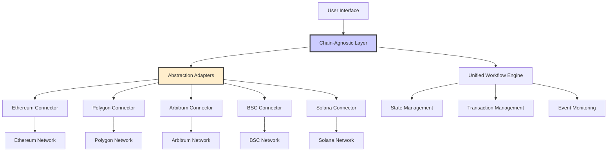

## Planned Universal Blockchain Integration

<Alert type="warning">
  **Development Status**: Multi-chain support is planned for Phase 2-3 development. Current focus is on Sei Network integration.
</Alert>

Zzyra's planned chain-agnostic architecture will enable seamless operation across multiple blockchain networks without requiring users or developers to understand the underlying complexities of each chain. This unified approach will eliminate vendor lock-in and enable workflows that span multiple ecosystems.

<Info>
  **Current Status**: Basic Web3 integration with focus on Sei Network
  **Vision**: Write once, run anywhere - workflows adaptable across any supported blockchain
</Info>

## Architecture Overview



## Planned Core Principles

### 1. Unified Interface (Development Roadmap)

<Alert type="info">
  **Development Focus**: Designing standardized blockchain interface for multi-chain support.
</Alert>

All blockchain interactions will go through a standardized interface:

```typescript
interface IBlockchainProvider {
  // Network Information
  getChainId(): Promise<number>;
  getNetworkName(): string;
  getNativeCurrency(): CurrencyInfo;

  // Account Operations
  getBalance(address: string, tokenAddress?: string): Promise<BigNumber>;
  getTransactionCount(address: string): Promise<number>;

  // Transaction Operations
  sendTransaction(transaction: Transaction): Promise<TransactionResponse>;
  waitForTransaction(hash: string): Promise<TransactionReceipt>;
  estimateGas(transaction: Transaction): Promise<BigNumber>;

  // Contract Interactions
  callContract(
    address: string,
    abi: any[],
    method: string,
    params: any[]
  ): Promise<any>;

  // Event Monitoring
  subscribeToEvents(
    address: string,
    eventName: string,
    callback: EventCallback
  ): Promise<EventSubscription>;
}
```

### 2. Network Configuration (Planned)

Chain-specific configurations will be abstracted away:

<Tabs>
  <Tab title="Ethereum">
```typescript
const ethereumConfig: ChainConfig = {
  chainId: 1,
  name: 'Ethereum Mainnet',
  rpcUrl: 'https://mainnet.infura.io/v3/...',
  blockExplorer: 'https://etherscan.io',
  nativeCurrency: {
    name: 'Ether',
    symbol: 'ETH',
    decimals: 18
  },
  gasSettings: {
    gasLimit: 21000,
    maxFeePerGas: 30000000000,
    maxPriorityFeePerGas: 2000000000
  }
};
```
  </Tab>
  
  <Tab title="Polygon">
```typescript
const polygonConfig: ChainConfig = {
  chainId: 137,
  name: 'Polygon Mainnet',
  rpcUrl: 'https://polygon-rpc.com',
  blockExplorer: 'https://polygonscan.com',
  nativeCurrency: {
    name: 'MATIC',
    symbol: 'MATIC',
    decimals: 18
  },
  gasSettings: {
    gasLimit: 21000,
    maxFeePerGas: 40000000000,
    maxPriorityFeePerGas: 30000000000
  }
};
```
  </Tab>
  
  <Tab title="Arbitrum">
```typescript
const arbitrumConfig: ChainConfig = {
  chainId: 42161,
  name: 'Arbitrum One',
  rpcUrl: 'https://arb1.arbitrum.io/rpc',
  blockExplorer: 'https://arbiscan.io',
  nativeCurrency: {
    name: 'Ether',
    symbol: 'ETH',
    decimals: 18
  },
  gasSettings: {
    gasLimit: 800000,
    gasPrice: 100000000
  }
};
```
  </Tab>
</Tabs>

### 3. Protocol Abstraction

Common DeFi operations work across different protocols:

```typescript
interface IDEXAdapter {
  getName(): string;
  getSupportedChains(): number[];

  // Unified trading interface
  getPrice(tokenA: string, tokenB: string): Promise<Price>;
  executeSwap(
    tokenA: string,
    tokenB: string,
    amount: string,
    slippage: number
  ): Promise<SwapResult>;

  // Liquidity operations
  addLiquidity(
    tokenA: string,
    tokenB: string,
    amountA: string,
    amountB: string
  ): Promise<LiquidityResult>;
}

// Implementation examples
class UniswapV3Adapter implements IDEXAdapter {
  supportedChains = [1, 137, 42161]; // Ethereum, Polygon, Arbitrum
  // Implementation...
}

class SushiSwapAdapter implements IDEXAdapter {
  supportedChains = [1, 137, 56]; // Ethereum, Polygon, BSC
  // Implementation...
}
```

## Multi-Chain Workflow Execution

### Cross-Chain State Management

Workflows can maintain state across multiple chains:

```typescript
class CrossChainWorkflowState {
  private chainStates: Map<number, ChainState> = new Map();

  async getBalance(chainId: number, address: string): Promise<string> {
    const provider = this.getProvider(chainId);
    return await provider.getBalance(address);
  }

  async executeAcrossChains(
    operations: CrossChainOperation[]
  ): Promise<ExecutionResult[]> {
    const results: ExecutionResult[] = [];

    for (const operation of operations) {
      const provider = this.getProvider(operation.chainId);
      const result = await provider.executeOperation(operation);
      results.push(result);

      // Update state for dependent operations
      await this.updateChainState(operation.chainId, result);
    }

    return results;
  }
}
```

### Bridge Integration

Seamless asset transfers between chains:

<AccordionGroup>
  <Accordion title='Native Bridges' icon='bridge'>
    Direct integration with official bridges like Polygon PoS Bridge, Arbitrum
    Bridge, and Optimism Gateway
  </Accordion>

<Accordion title='Third-Party Bridges' icon='exchange-alt'>
  Support for popular bridges like Hop Protocol, Synapse, and Multichain for
  broader connectivity
</Accordion>

<Accordion title='Bridge Aggregation' icon='layer-group'>
  AI-powered selection of optimal bridge routes based on cost, speed, and
  security
</Accordion>

  <Accordion title='Failed Bridge Recovery' icon='redo'>
    Automatic detection and recovery mechanisms for failed bridge transactions
  </Accordion>
</AccordionGroup>

## Protocol-Specific Optimizations

While maintaining chain-agnostic interfaces, Zzyra optimizes for each network's unique characteristics:

### Gas Optimization Strategies

<CardGroup cols={2}>
  <Card title='Ethereum' icon='ethereum'>
    - **EIP-1559 Optimization**: Dynamic gas fee adjustment - **Gas Token
    Utilization**: CHI token for gas savings - **Batch Operations**: Multicall
    for reduced gas costs - **MEV Protection**: Flashbots integration for secure
    transactions
  </Card>

<Card title='Polygon' icon='polygon'>
  - **Fast Confirmations**: Leverage 2-second block times - **Low Gas Costs**:
  Optimize for high-frequency operations - **Native Bridge**: Direct MATIC
  bridge integration - **Checkpoint Monitoring**: Track checkpoint submissions
</Card>

<Card title='Arbitrum' icon='arbitrum'>
  - **L2 Gas Model**: Optimize for Arbitrum's unique gas calculation - **Batch
  Submission**: Leverage batch transaction efficiency - **Sequencer
  Monitoring**: Track sequencer health and delays - **L1/L2 Coordination**:
  Manage cross-layer operations
</Card>

  <Card title='Solana' icon='solana'>
    - **Program Accounts**: Efficient account management - **Parallel
    Processing**: Leverage Solana's parallel execution - **Rent Optimization**:
    Minimize account rent costs - **Priority Fees**: Dynamic fee adjustment for
    faster processing
  </Card>
</CardGroup>

## Block Implementation

### Chain-Agnostic Block Example

```typescript
@Block({
  name: "Token Transfer",
  description: "Transfer tokens on any supported blockchain",
  category: "Web3 Operations",
  supportedChains: ["ethereum", "polygon", "arbitrum", "bsc"],
})
export class TokenTransferBlock {
  @BlockConfig()
  config: {
    chainId: number;
    tokenAddress: string;
    recipientAddress: string;
    amount: string;
  };

  async execute(): Promise<TransferResult> {
    // Get chain-specific provider
    const provider = this.getChainProvider(this.config.chainId);

    // Execute transfer using unified interface
    const transaction = await provider.transferToken({
      token: this.config.tokenAddress,
      to: this.config.recipientAddress,
      amount: this.config.amount,
    });

    // Wait for confirmation with chain-specific parameters
    const receipt = await provider.waitForTransaction(
      transaction.hash,
      this.getConfirmationRequirement(this.config.chainId)
    );

    return {
      transactionHash: receipt.transactionHash,
      blockNumber: receipt.blockNumber,
      gasUsed: receipt.gasUsed.toString(),
      chainId: this.config.chainId,
    };
  }

  // Chain-specific confirmation requirements
  private getConfirmationRequirement(chainId: number): number {
    const requirements = {
      1: 12, // Ethereum - 12 confirmations
      137: 3, // Polygon - 3 confirmations
      42161: 1, // Arbitrum - 1 confirmation
      56: 5, // BSC - 5 confirmations
    };
    return requirements[chainId] || 1;
  }
}
```

### Multi-Chain Workflow Example

```typescript
// Example: Cross-chain arbitrage workflow
const crossChainArbitrage = {
  name: "Cross-Chain Arbitrage",
  description: "Buy low on one chain, sell high on another",

  steps: [
    {
      blockType: "PriceMonitor",
      config: {
        tokenPair: "USDC/ETH",
        chains: [1, 137], // Ethereum and Polygon
        threshold: 0.5, // 0.5% price difference
      },
    },
    {
      blockType: "ConditionalExecution",
      config: {
        condition: "priceSpread > threshold",
      },
    },
    {
      blockType: "TokenSwap",
      config: {
        chainId: "{{ lowerPriceChain }}",
        fromToken: "USDC",
        toToken: "ETH",
        amount: "1000",
      },
    },
    {
      blockType: "BridgeTransfer",
      config: {
        fromChain: "{{ lowerPriceChain }}",
        toChain: "{{ higherPriceChain }}",
        token: "ETH",
        amount: "{{ swapResult.outputAmount }}",
      },
    },
    {
      blockType: "TokenSwap",
      config: {
        chainId: "{{ higherPriceChain }}",
        fromToken: "ETH",
        toToken: "USDC",
        amount: "{{ bridgeResult.outputAmount }}",
      },
    },
  ],
};
```

## Future Chain Support

Zzyra's architecture is designed for easy addition of new blockchain networks:

### Integration Framework

<Steps>
  <Step title='Provider Implementation'>
    Implement the IBlockchainProvider interface for the new chain
  </Step>
  <Step title='Configuration Setup'>
    Add chain configuration with RPC endpoints, gas settings, and network
    parameters
  </Step>
  <Step title='Testing Suite'>
    Run comprehensive tests against testnet and mainnet
  </Step>
  <Step title='Block Updates'>
    Update existing blocks to support the new chain where applicable
  </Step>
  <Step title='Documentation'>
    Add chain-specific documentation and examples
  </Step>
</Steps>

### Roadmap for New Chains

<CardGroup cols={3}>
  <Card title='Avalanche' icon='mountain'>
    **Status**: In Development **ETA**: Q2 2024 **Features**: Subnet support,
    native AVAX operations
  </Card>

<Card title='Cosmos' icon='atom'>
  **Status**: Planned **ETA**: Q3 2024 **Features**: IBC protocol, multi-chain
  staking
</Card>

  <Card title='Polkadot' icon='polkadot'>
    **Status**: Research **ETA**: Q4 2024 **Features**: Parachain integration,
    cross-chain messaging
  </Card>
</CardGroup>

## Best Practices

### When to Use Chain-Agnostic Features

<AccordionGroup>
  <Accordion title='Multi-Chain Portfolios' icon='wallet'>
    Managing assets across multiple chains with unified strategies and reporting
  </Accordion>

<Accordion title='Cross-Chain Arbitrage' icon='exchange-alt'>
  Taking advantage of price differences between chains for the same assets
</Accordion>

<Accordion title='Risk Diversification' icon='shield-alt'>
  Spreading protocol risk across multiple blockchain ecosystems
</Accordion>

  <Accordion title='Cost Optimization' icon='dollar-sign'>
    Moving operations to lower-cost chains when network congestion is high
  </Accordion>
</AccordionGroup>

### Chain-Specific Considerations

<Warning>
  While Zzyra provides chain-agnostic interfaces, always consider: - **Finality
  differences**: Ethereum needs more confirmations than Polygon - **Gas
  models**: EIP-1559 vs. legacy gas pricing - **Block times**: Faster chains
  enable different strategies - **Bridge risks**: Cross-chain transfers have
  additional security considerations
</Warning>

## Getting Started

Ready to build chain-agnostic workflows?

<CardGroup cols={3}>
  <Card
    title='Multi-Chain Tutorial'
    icon='graduation-cap'
    href='/developers/tutorials/multi-chain'>
    Learn to build your first cross-chain workflow
  </Card>
  <Card
    title='Supported Chains'
    icon='link'
    href='/developers/supported-chains'>
    View all supported blockchain networks
  </Card>
  <Card title='Bridge Integration' icon='bridge' href='/developers/bridges'>
    Integrate cross-chain asset transfers
  </Card>
</CardGroup>

<Note>
  Chain-agnostic architecture is one of Zzyra's key differentiators, enabling
  workflows that adapt to changing market conditions and network performance
  across the entire blockchain ecosystem.
</Note>
