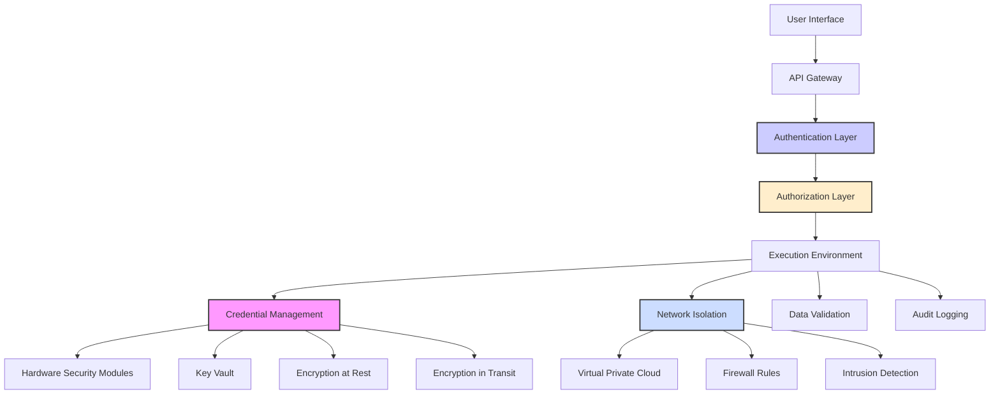

## Security Framework Overview

<Alert type="warning">
  **Development Status**: Zzyra's security framework is in active development. While basic security measures are in place, many advanced enterprise features described here represent our development roadmap.
</Alert>

Zzyra's planned security framework will implement a defense-in-depth approach, designed to protect sensitive operations across both traditional enterprise systems and blockchain networks. Security considerations are being embedded at every architectural layer.

<Info>
  **Current Security**: Basic authentication via Magic SDK and secure database storage are implemented.
  **Planned Security**: Comprehensive enterprise-grade security layers for protecting private keys, credentials, and business-critical operations.
</Info>

## Security Architecture Overview



## Core Security Principles

### 1. Defense in Depth (Planned)

<Alert type="info">
  **Development Roadmap**: Multi-layer security architecture planned for enterprise deployment.
</Alert>

Planned security layers to protect against various threat vectors:

<CardGroup cols={2}>
  <Card title='Perimeter Security' icon='shield'>
    📋 Planned: API gateways, firewalls, and DDoS protection at the network edge
  </Card>
  <Card title='Application Security' icon='code'>
    🚧 In Development: Secure coding practices, input validation, and output encoding
  </Card>
  <Card title='Data Security' icon='database'>
    ✅ Current: Basic encryption | 📋 Planned: Advanced encryption at rest and in transit
  </Card>
  <Card title='Infrastructure Security' icon='server'>
    📋 Planned: Hardened systems, network segmentation, monitoring
  </Card>
</CardGroup>

### 2. Principle of Least Privilege (Development Vision)

<Alert type="info">
  **Current Status**: Basic role-based access planned. Advanced least privilege controls in development.
</Alert>

Planned access control approach:

<AccordionGroup>
  <Accordion title='User Access Control' icon='user-check'>
    Users receive only the permissions necessary for their specific role and
    responsibilities within the organization.
  </Accordion>

{" "}
<Accordion title='Service Permissions' icon='gear'>
  Each service component has access only to the resources and data required for
  its specific function.
</Accordion>

{" "}
<Accordion title='API Limitations' icon='key'>
  API keys and service accounts are scoped to specific operations with
  time-based restrictions where appropriate.
</Accordion>

  <Accordion title='Network Access' icon='network-wired'>
    Network connections are restricted to required endpoints with explicit
    allow-listing and monitoring.
  </Accordion>
</AccordionGroup>

### 3. Zero Trust Security Model (Future Implementation)

<Alert type="warning">
  **Development Roadmap**: Zero Trust architecture planned for future enterprise deployment.
</Alert>

Planned zero trust implementation:

- **Continuous Verification**: 📋 Planned - All requests will be authenticated and authorized
- **Contextual Access**: 📋 Planned - Access decisions based on user, device, location, and behavior
- **Micro-Segmentation**: 📋 Planned - Network traffic isolation and monitoring
- **Behavioral Analysis**: 📋 Planned - Anomalous behavior triggers additional verification

## Credential Management

<Alert type="info">
  **Current Status**: Basic credential storage via Magic SDK. Advanced credential management system in development.
</Alert>

### Planned Secure Storage Architecture

```typescript
interface CredentialManager {
  storeCredential(userId: string, credential: Credential): Promise<string>;
  retrieveCredential(userId: string, credentialId: string): Promise<Credential>;
  rotateCredential(credentialId: string): Promise<void>;
  revokeCredential(credentialId: string): Promise<void>;
}

interface Credential {
  id: string;
  type: CredentialType;
  encryptedValue: string;
  metadata: CredentialMetadata;
  permissions: Permission[];
  expirationDate?: Date;
}

enum CredentialType {
  PRIVATE_KEY = "private_key",
  API_TOKEN = "api_token",
  DATABASE_PASSWORD = "database_password",
  SERVICE_ACCOUNT = "service_account",
}
```

### Hardware Security Modules (HSMs) - Future Implementation

<Alert type="warning">
  **Development Vision**: HSM integration planned for enterprise security requirements.
</Alert>

Planned HSM capabilities:

<Tabs>
  <Tab title='HSM Integration'>
    - **Key Generation**: Cryptographic keys generated within HSM - **Secure
    Operations**: Private key operations never leave HSM - **Tamper
    Resistance**: Hardware-level protection against physical attacks - **FIPS
    140-2 Level 3**: Certified security standard compliance
  </Tab>

{" "}
<Tab title='Key Management'>
  - **Hierarchical Keys**: Master keys protect data encryption keys - **Key
  Rotation**: Automated rotation with zero downtime - **Backup & Recovery**:
  Secure key backup with geographic distribution - **Audit Trails**: Complete
  key usage logging
</Tab>

  <Tab title='Performance'>
    - **High Throughput**: Support for high-volume operations - **Low Latency**:
    Optimized for real-time transaction signing - **Scalability**: Horizontal
    scaling for enterprise workloads - **Availability**: 99.99% uptime with
    redundancy
  </Tab>
</Tabs>

### Credential Isolation (Planned)

<Alert type="info">
  **Development Roadmap**: Advanced credential isolation system planned for production deployment.
</Alert>

Planned credential type isolation:

#### Blockchain Private Keys

```typescript
class BlockchainKeyManager {
  private hsmClient: HSMClient;

  async signTransaction(
    keyId: string,
    transaction: Transaction
  ): Promise<SignedTransaction> {
    // Validate transaction before signing
    await this.validateTransaction(transaction);

    // Sign within HSM - private key never exposed
    const signature = await this.hsmClient.sign(keyId, transaction.hash);

    // Log signing operation
    await this.auditLog.record({
      operation: "transaction_sign",
      keyId,
      transactionHash: transaction.hash,
      timestamp: Date.now(),
    });

    return { ...transaction, signature };
  }
}
```

#### Enterprise API Credentials

```typescript
class EnterpriseCredentialVault {
  async getAPICredential(
    userId: string,
    service: string
  ): Promise<APICredential> {
    // Check user permissions
    await this.verifyAccess(userId, service);

    // Retrieve from encrypted vault
    const encrypted = await this.vault.get(`${userId}:${service}`);

    // Decrypt only for authorized request
    const credential = await this.decrypt(encrypted, userId);

    // Return time-limited credential
    return this.createTemporaryCredential(credential);
  }
}
```

## Role-Based Access Control (RBAC) - In Development

<Alert type="warning">
  **Current Status**: Basic authentication implemented. Advanced RBAC system in development.
</Alert>

### Planned Permission Model

Granular permissions will govern all platform operations:

```typescript
interface Permission {
  resource: string;
  actions: Action[];
  conditions?: Condition[];
}

interface Role {
  name: string;
  description: string;
  permissions: Permission[];
  inherits?: string[];
}

interface UserRole {
  userId: string;
  roleId: string;
  grantedBy: string;
  grantedAt: Date;
  expiresAt?: Date;
}

// Example role definitions
const ROLES = {
  ADMIN: {
    name: "Platform Administrator",
    permissions: [{ resource: "*", actions: ["*"] }],
  },
  WORKFLOW_MANAGER: {
    name: "Workflow Manager",
    permissions: [
      {
        resource: "workflows",
        actions: ["create", "read", "update", "delete"],
      },
      { resource: "executions", actions: ["read", "trigger"] },
    ],
  },
  VIEWER: {
    name: "Read-Only User",
    permissions: [
      { resource: "workflows", actions: ["read"] },
      { resource: "executions", actions: ["read"] },
    ],
  },
};
```

### Dynamic Permission Evaluation

```typescript
class PermissionEngine {
  async hasPermission(
    userId: string,
    resource: string,
    action: string,
    context?: SecurityContext
  ): Promise<boolean> {
    const userRoles = await this.getUserRoles(userId);
    const permissions = await this.aggregatePermissions(userRoles);

    return this.evaluatePermission(permissions, resource, action, context);
  }

  private evaluatePermission(
    permissions: Permission[],
    resource: string,
    action: string,
    context?: SecurityContext
  ): boolean {
    for (const permission of permissions) {
      if (
        this.matchesResource(permission.resource, resource) &&
        this.matchesAction(permission.actions, action) &&
        this.matchesConditions(permission.conditions, context)
      ) {
        return true;
      }
    }
    return false;
  }
}
```

## Network Security (Development Roadmap)

<Alert type="info">
  **Development Status**: Network security architecture planned for production deployment.
</Alert>

### Planned Virtual Private Cloud (VPC) Architecture

<AccordionGroup>
  <Accordion title='Network Segmentation' icon='sitemap'>
    Separate subnets for different service tiers with controlled inter-subnet
    communication through security groups and NACLs.
  </Accordion>

{" "}
<Accordion title='Private Subnets' icon='lock'>
  Sensitive services run in private subnets with no direct internet access,
  communicating through NAT gateways.
</Accordion>

{" "}
<Accordion title='Public Subnets' icon='globe'>
  Only load balancers and API gateways in public subnets, with strict ingress
  rules and DDoS protection.
</Accordion>

  <Accordion title='Database Security' icon='database'>
    Databases in isolated subnets with encryption at rest, backup encryption,
    and access restricted to application tiers.
  </Accordion>
</AccordionGroup>

### Firewall and Intrusion Detection

```typescript
interface SecurityRule {
  id: string;
  type: "allow" | "deny";
  protocol: "tcp" | "udp" | "icmp";
  sourceIp?: string;
  destinationPort?: number;
  description: string;
}

interface SecurityEvent {
  timestamp: Date;
  sourceIp: string;
  eventType: SecurityEventType;
  severity: "low" | "medium" | "high" | "critical";
  details: any;
}

class IntrusionDetectionSystem {
  async analyzeTraffic(packet: NetworkPacket): Promise<SecurityEvent[]> {
    const events: SecurityEvent[] = [];

    // Check against known attack patterns
    if (await this.detectSQLInjection(packet)) {
      events.push(this.createSecurityEvent("sql_injection", "high", packet));
    }

    // Analyze traffic patterns
    if (await this.detectDDoS(packet)) {
      events.push(this.createSecurityEvent("ddos_attempt", "critical", packet));
    }

    return events;
  }
}
```

## Data Protection

<Info>
  **Current Status**: Database encryption in place via PostgreSQL. Advanced encryption features in development.
</Info>

### Planned Encryption Standards

<Tabs>
  <Tab title='Encryption at Rest'>
    - **AES-256**: Industry-standard encryption for stored data - **Key
    Management**: HSM-backed key management system - **Database Encryption**:
    Transparent data encryption (TDE) - **File System**: Encrypted storage
    volumes
  </Tab>

{" "}
<Tab title='Encryption in Transit'>
  - **TLS 1.3**: Latest transport layer security - **Certificate Management**:
  Automated certificate rotation - **End-to-End**: Encryption between all
  service components - **API Security**: OAuth 2.0 with JWT tokens
</Tab>

  <Tab title='Application-Level'>
    - **Field Encryption**: Sensitive fields encrypted separately - **Format
    Preserving**: Encryption maintaining data format - **Tokenization**: Replace
    sensitive data with tokens - **Secure Enclaves**: Protected execution
    environments
  </Tab>
</Tabs>

### Data Loss Prevention (DLP)

```typescript
interface DLPPolicy {
  name: string;
  rules: DLPRule[];
  actions: DLPAction[];
}

interface DLPRule {
  pattern: string | RegExp;
  dataType: "credit_card" | "ssn" | "private_key" | "api_key";
  sensitivity: "low" | "medium" | "high";
}

class DataLossPreventionEngine {
  async scanContent(content: string): Promise<DLPViolation[]> {
    const violations: DLPViolation[] = [];

    for (const policy of this.policies) {
      const matches = await this.applyPolicy(policy, content);
      violations.push(...matches);
    }

    return violations;
  }

  private async applyPolicy(
    policy: DLPPolicy,
    content: string
  ): Promise<DLPViolation[]> {
    // Implementation of policy matching logic
    return this.detectSensitiveData(policy.rules, content);
  }
}
```

## Audit and Compliance (Development Vision)

<Alert type="warning">
  **Current Status**: Basic logging implemented. Comprehensive audit system in development.
</Alert>

### Planned Comprehensive Audit Trails

All system activities will be logged for security and compliance:

```typescript
interface AuditEvent {
  eventId: string;
  timestamp: Date;
  userId?: string;
  sessionId?: string;
  eventType: AuditEventType;
  resource: string;
  action: string;
  success: boolean;
  ipAddress: string;
  userAgent?: string;
  metadata: any;
}

enum AuditEventType {
  AUTHENTICATION = "authentication",
  AUTHORIZATION = "authorization",
  DATA_ACCESS = "data_access",
  WORKFLOW_EXECUTION = "workflow_execution",
  CREDENTIAL_ACCESS = "credential_access",
  CONFIGURATION_CHANGE = "configuration_change",
}

class AuditLogger {
  async logEvent(event: AuditEvent): Promise<void> {
    // Encrypt sensitive audit data
    const encryptedEvent = await this.encryptAuditData(event);

    // Store in tamper-evident log
    await this.tamperProofStorage.store(encryptedEvent);

    // Send to SIEM if critical event
    if (this.isCriticalEvent(event)) {
      await this.siemIntegration.send(event);
    }
  }
}
```

### Planned Compliance Frameworks

<Alert type="info">
  **Development Roadmap**: Compliance framework support planned for enterprise deployment.
</Alert>

Zzyra will support various compliance requirements:

<AccordionGroup>
  <Accordion title='SOC 2 Type II' icon='certificate'>
    Comprehensive controls for security, availability, processing integrity,
    confidentiality, and privacy of customer data.
  </Accordion>

{" "}
<Accordion title='GDPR Compliance' icon='balance-scale'>
  Data protection controls including right to erasure, data portability, and
  privacy by design principles.
</Accordion>

{" "}
<Accordion title='HIPAA (Healthcare)' icon='user-shield'>
  Additional controls for healthcare data including business associate
  agreements and enhanced encryption.
</Accordion>

  <Accordion title='PCI DSS' icon='credit-card'>
    Payment card industry security standards for systems handling cardholder
    data.
  </Accordion>
</AccordionGroup>

## Transaction Safety (Development Priority)

<Alert type="info">
  **Current Status**: Basic transaction execution. Advanced safety features in development.
</Alert>

### Planned Blockchain Transaction Security

Planned protections for blockchain operations:

<CardGroup cols={2}>
  <Card title='Simulation Mode' icon='flask'>
    Test transactions in simulation before execution to prevent costly mistakes
  </Card>
  <Card title='Multi-Signature' icon='users'>
    Require multiple approvals for high-value or sensitive transactions
  </Card>
  <Card title='Spending Limits' icon='credit-card'>
    Configurable daily/monthly limits for automated transactions
  </Card>
  <Card title='Approval Workflows' icon='list-check'>
    Manual approval requirements for transactions above thresholds
  </Card>
</CardGroup>

### Smart Contract Security

```typescript
interface ContractSecurityCheck {
  contractAddress: string;
  abi: any[];
  securityScore: number;
  risks: SecurityRisk[];
  recommendations: string[];
}

interface SecurityRisk {
  type: "reentrancy" | "overflow" | "access_control" | "oracle_manipulation";
  severity: "low" | "medium" | "high" | "critical";
  description: string;
  mitigation?: string;
}

class SmartContractValidator {
  async validateContract(address: string): Promise<ContractSecurityCheck> {
    const bytecode = await this.getBytecode(address);
    const risks = await this.analyzeRisks(bytecode);
    const auditStatus = await this.checkAuditStatus(address);

    return {
      contractAddress: address,
      abi: await this.getABI(address),
      securityScore: this.calculateSecurityScore(risks, auditStatus),
      risks,
      recommendations: this.generateRecommendations(risks),
    };
  }
}
```

## Incident Response (Future Implementation)

<Alert type="warning">
  **Development Vision**: Comprehensive incident response system planned for production.
</Alert>

### Planned Security Incident Management

Structured approach to security incidents:

<Steps>
  <Step title='Detection'>
    Automated monitoring systems detect potential security incidents
  </Step>
  <Step title='Classification'>
    Incidents are classified by severity and potential impact
  </Step>
  <Step title='Response'>
    Automated and manual response procedures are triggered
  </Step>
  <Step title='Investigation'>
    Forensic analysis determines scope and root cause
  </Step>
  <Step title='Recovery'>Systems are restored to secure operational state</Step>
  <Step title='Post-Incident'>
    Lessons learned are incorporated into security improvements
  </Step>
</Steps>

### Automated Response Capabilities

```typescript
interface IncidentResponse {
  trigger: SecurityEvent;
  actions: ResponseAction[];
  escalation: EscalationRule[];
}

interface ResponseAction {
  type: "block_ip" | "revoke_credentials" | "quarantine_user" | "alert_admin";
  parameters: any;
  automatic: boolean;
}

class IncidentResponseSystem {
  async handleIncident(event: SecurityEvent): Promise<void> {
    const response = this.getResponsePlan(event.eventType);

    for (const action of response.actions) {
      if (action.automatic) {
        await this.executeAction(action);
      } else {
        await this.requestManualIntervention(action);
      }
    }

    // Escalate if necessary
    if (this.shouldEscalate(event, response)) {
      await this.escalateIncident(event);
    }
  }
}
```

## Security Monitoring (Development Roadmap)

<Alert type="info">
  **Current Status**: Basic application monitoring. Advanced threat detection in development.
</Alert>

### Planned Real-Time Threat Detection

<AccordionGroup>
  <Accordion title='Behavioral Analytics' icon='chart-line'>
    AI-powered analysis of user behavior to detect anomalies and potential
    insider threats.
  </Accordion>

{" "}
<Accordion title='Network Monitoring' icon='network-wired'>
  Continuous monitoring of network traffic for malicious activity and data
  exfiltration attempts.
</Accordion>

{" "}
<Accordion title='Application Security' icon='shield-check'>
  Runtime application security monitoring (RASP) to detect and prevent attacks.
</Accordion>

  <Accordion title='Infrastructure Monitoring' icon='server'>
    System-level monitoring for unauthorized access, privilege escalation, and
    malware.
  </Accordion>
</AccordionGroup>

### Security Metrics and KPIs

- **Mean Time to Detection (MTTD)**: Average time to detect security incidents
- **Mean Time to Response (MTTR)**: Average time to respond to incidents
- **Security Score**: Overall security posture measurement
- **Vulnerability Metrics**: Number and severity of identified vulnerabilities
- **Compliance Score**: Adherence to regulatory requirements

## Security Development Roadmap

### Implementation Phases

<Tabs>
  <Tab title='Phase 1: Foundation (Q1-Q2 2025)'>
    📋 Planned:
    - Enhanced authentication & authorization
    - Basic audit logging system
    - Secure credential storage
    - Input validation & sanitization
  </Tab>

{" "}
<Tab title='Phase 2: Enterprise (Q3-Q4 2025)'>
  📋 Planned:
  - Role-based access control (RBAC)
  - Advanced encryption capabilities
  - Security monitoring dashboard
  - Compliance framework foundations
</Tab>

  <Tab title='Phase 3: Advanced (2026+)'>
    📋 Long-term Vision:
    - Zero Trust architecture
    - HSM integration
    - AI-powered threat detection
    - Quantum-resistant cryptography preparation
  </Tab>
</Tabs>

<Note>
  **Development Note**: Security is a top priority in Zzyra's development roadmap. While we're building towards enterprise-grade security, current implementation focuses on foundational security measures with plans for comprehensive security frameworks.
</Note>

## Learn More

Explore security across different aspects of Zzyra:

<CardGroup cols={3}>
  <Card
    title='Architecture Overview'
    icon='sitemap'
    href='/platform/architecture/overview'>
    Security in overall architecture
  </Card>
  <Card
    title='Best Practices'
    icon='shield-check'
    href='/developers/advanced/security'>
    Security best practices for developers
  </Card>
  <Card title='Compliance' icon='balance-scale' href='/business/compliance'>
    Regulatory compliance features
  </Card>
</CardGroup>{" "}
