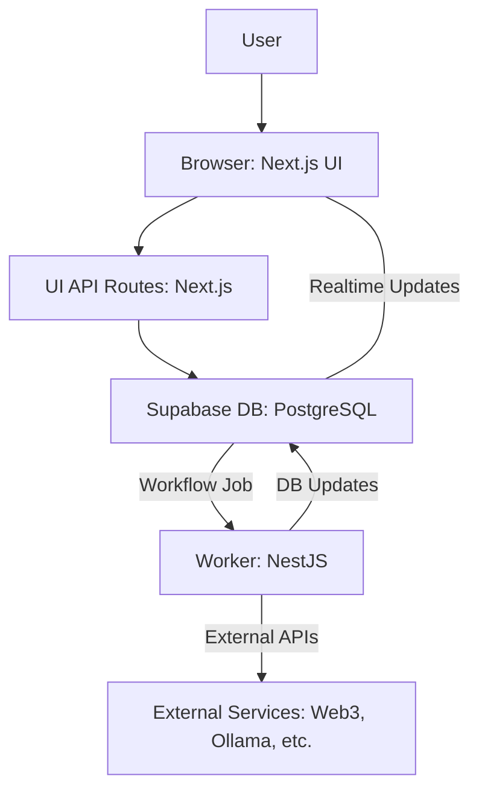

# System Architecture

## Overview

Zyra is built using a monorepo structure housing two main components: a Next.js frontend (`ui/`) and a Node.js/NestJS backend worker (`zyra-worker/`). These components interact primarily through a Supabase (PostgreSQL) database, which acts as both a data store and a message queue for workflow execution.

## Tech Stack

-   **Frontend (`ui/`):**
    -   Framework: Next.js 14+ (App Router)
    -   Language: TypeScript
    -   UI: React, Tailwind CSS, PostCSS
    -   State Management: Zustand (or relevant library)
    -   API: Next.js API Routes
    -   Deployment: Netlify
-   **Backend (`zyra-worker/`):**
    -   Framework: NestJS
    -   Language: TypeScript
    -   Runtime: Node.js v20.3.0+
    -   Testing: Jest
-   **Database:**
    -   Service: Supabase
    -   Engine: PostgreSQL
    -   Migrations: Managed via Supabase CLI (`ui/supabase/migrations/`)
    -   Security: Row-Level Security (RLS) enforced on critical tables.
-   **Key Integrations:**
    -   AI: OpenRouter (Cloud), Ollama (Local/Optional)
    -   Blockchain: Ethers.js / Viem (or relevant web3 libraries)
    -   Analytics: PostHog
-   **Development:**
    -   Package Manager: pnpm

## Component Breakdown

1.  **UI (`ui/`) - Next.js Application:**
    -   **Responsibilities:** User authentication, dashboard, workflow builder (React Flow), block catalog, settings (billing, notifications), API endpoints for frontend interactions (saving workflows, triggering generation, etc.).
    -   **Key Features:** Visual drag-and-drop interface, AI Copilot integration for workflow/block generation, real-time updates via Supabase subscriptions (optional), user management.
    -   **API Routes:** Handles server-side logic tightly coupled with the UI, such as user-specific data fetching, AI generation requests, and basic workflow operations.

2.  **Worker (`zyra-worker/`) - NestJS Service:**
    -   **Responsibilities:** Asynchronously executing workflow steps dequeued from Supabase, interacting with external APIs (Web3, AI models, other integrations), calculating costs, sending notifications (future), updating execution status and logs in the database.
    -   **Decoupling:** Runs independently from the UI, ensuring workflow execution doesn't block user interactions. Communicates via the database.

3.  **Database (Supabase/PostgreSQL):**
    -   **Core Tables:** `users`, `workflows`, `custom_blocks`, `workflow_executions`, `execution_logs`, `node_logs`, `notification_templates` (planned), etc. (Refer to `ui/supabase/migrations/` for the definitive schema).
    -   **Queue:** Uses a table (e.g., `workflow_queue` or utilizes `workflow_executions` status) managed by the worker for processing jobs.
    -   **Data Persistence:** Stores all user data, workflow definitions, custom blocks, execution history, and logs.

4.  **AI Services (OpenRouter / Ollama):**
    -   **Workflow/Block Generation:** Used by the UI API routes via the `AIProvider` interface to generate workflow structures and custom block code based on user prompts.
    -   **Runtime AI Blocks:** Certain workflow blocks might call out to AI services during execution (handled by the worker).

5.  **External Services:**
    -   Includes blockchain nodes/providers, third-party APIs integrated via custom blocks, notification services (Email, Telegram - planned).

## Data Flow Example (Workflow Execution)

1.  User triggers workflow execution via the UI.
2.  UI API route inserts/updates an entry in the `workflow_executions` table in Supabase, marking it as 'queued'.
3.  The `zyra-worker` polls the database for 'queued' executions.
4.  Worker picks up a job, updates its status to 'running', and sets `locked_by`.
5.  Worker executes nodes sequentially based on workflow definition.
    -   Fetches node logic (built-in or custom block code).
    -   Makes necessary external API calls (Web3, AI, etc.).
    -   Logs output/status for each node in `node_logs`.
6.  Upon completion/failure, the worker updates the main `workflow_executions` status and logs final results/errors.
7.  (Optional) UI can listen for real-time changes in `workflow_executions` or `node_logs` via Supabase subscriptions to display progress.
